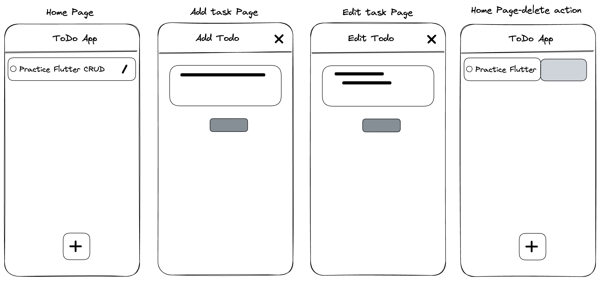

# flutter_crud_todo_getx
## A Todo App

This App illustrates CRUD operations using GetX package. It is a simple Todo App that allows you to create, read, update and delete tasks. In this example the tasks are not permanently stored in a database. Instead, they are stored in a list. The list is stored in the memory of the device. When the app is closed, the list is lost. This is just an example to show how to implement CRUD operations in Flutter using GetX. The purpose of this example is to simply undersand CRUD operations. In a real world application, you would use a database to store the data. I will be creating an exact copy of this app using a database in the future. Stay tuned!

I have tried to keep the code as simple as possible. I have also tried to explain the code as much as possible. I hope you find this example useful.

- What is CRUD?
  CRUD stands for Create, Read, Update and Delete. It is a set of operations that are performed usually on a database. CRUD operations are basic functions that are used in most applications. Having a good understanding of CRUD operations is important for any developer. The purpose of this article is to explain what CRUD operations are and how to implement them in Flutter.

- What is GetX?
  GetX is a Flutter library that helps you to use the Reactive Programming paradigm in your Flutter applications. It is a wrapper around the Flutter framework that allows you to use the Observer pattern in your applications. GetX is like a micro framework by itself. Apart of State management and Reactive Programming, it also provides a lot of other features.
  To learn more about GetX, visit the official website: https://pub.dev/packages/get

  ## Getting Started

  This app folllows MVC pattern (Model-View-Controller). The Model is the data that is stored in the app. The View is the UI of the app. The Controller is the logic of the app. The Controller is responsible for fetching the data from the Model and displaying it in the View. The Controller is also responsible for updating the Model when the user interacts with the View. The Controller is the bridge between the Model and the View. 
  In the project there are corresponding folders for Model, View and Controller. The View folder has 3 files each responsile for 3 separate view .
  - todo_home_page.dart: This file contains the UI for the home page. It displays the list of tasks.
  - add_todo_page.dart: This file contains the UI for the add task page. It allows the user to add a new task.
  - edit_todo_page.dart: This file contains the UI for the edit task page. It allows the user to edit an existing task.

The entry point of the app is the HomePage. TodoHomePage starts with the empty list with a loop animation. Click a button to create new task. This takes you to a separate view/page, AddTodoPage. You can add a task here in the textform field and submit which takes you back to initial page with the new list of task. You can also edit the task by clicking on the edit button. This takes you to a separate view/page, EditTodoPage. You can edit the task here in the textform which takes you back to initial page with the updated list of task. You can delete the task by sliding the task card all the way to the left. This deletes the task and serves the updated list of task.
All the functions to add , delete and update tasks reside in the task_controller.  

## Project ideation & Visualisation
#### Wireframe

## packages/dependencies used:

- [Flutter](https://flutter.dev/)
- [GetX](https://pub.dev/packages/get/install)
- [SQFLite](https://pub.dev/packages/sqflite/install)
- [Path Provider](https://pub.dev/packages/path_provider)
- [Lottie](https://pub.dev/packages/lottie)

## Credits:
- [LottieFiles](https://lottiefiles.com/78631-searching)